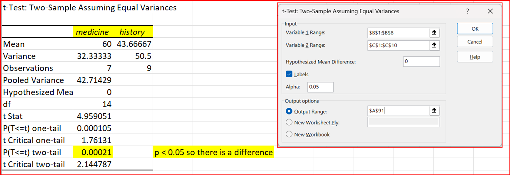
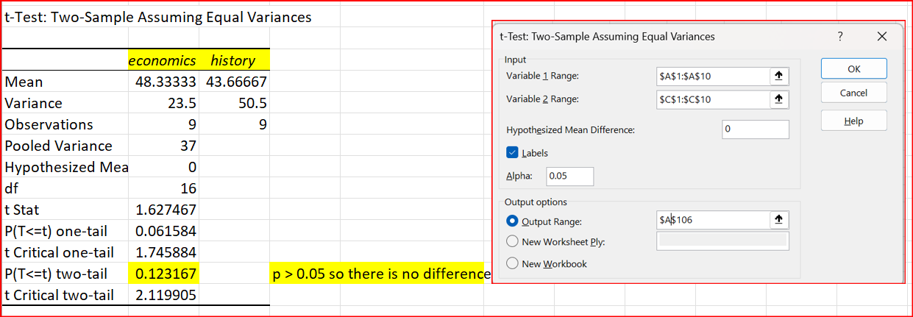

A single factor or one-way ANOVA is used to test the null hypothesis that the means of several populations are all equal. In this example, you find the salaries of people who have a degree in economics, medicine, or history. You can see that the groups are not related because they have different numbers of observations in the groups. 
Null hypothesis: H0: μ1 = μ2 = μ3 (meaning that the means/averages of all three groups are the same)
Alternative hypothesis: H1: at least one of the means is different.
If we find that at least one mean is different, you can do  pairwise comparisons with t tests to see where there is a difference and where not. In this example, there is at least one different group. The type of t test depends on whether the two samples have equal variances or not, and whether the observations are paired. In this example, they are not paired but we don't know about the variances yet. 

First we  check if the means are equal.
- On the Data tab, in the Analysis group, click Data Analysis. If it is not available, you may need to install the Analysis Toolpak.

- Select Anova: Single Factor
- Enter the data as in the picture below. You can click the up arrow for Input Range and Output Range to use the mouse to select.In this case, we  include the labels (row 1) so select the labels box.

- The ANOVA results show that there is at least  one difference between groups, since the p value is 0.0000716 which is less than 0.05 (5%). The ANOVA does not tell you where the difference(s) lie(s), so you need to do a t test to test each pair of means.

- go to the analysis with F tests tab
- first we check if medicine and economics have equal variances. The group with the larger variance needs to be in the Variable 1 Range, so that is medicine with 32.333 (economics has variance of 23.5). F is less than F critical so the variances are equal.  You can also see that the  p value is 0.32, well above 0.05 (5%).

- then we check if history and medicine have equal variances. The group with the larger variance needs to be in the Variable 1 Range, so that  is history with 50.5 (medicine has variance of 32.333).F is less than F critical so the variances are equal. You can also see that the p value is 0.30, well above 0.05 (5% ).

- finally, we check if history and economics have equal variances. The group with the larger variance needs to be in the Variable 1 Range, so that  is history with 50.5 (economics has variance of 23.5).F is less than F critical so the variances are equal. You can also see that the p value is 0.149, well above 0.05 (5% ).

All variances are equal so we can now progress to t tests for equal variances. If there had been differences in variance, we would have needed to use t tests for unequal variances.

- go the the analysis with t tests tab. It has copied the previous outputs, so continue from row 74. 
- first we check between econommics and medicine

- we need to look at the two-tail p value since we check if there is a difference either  way. (if we had hypothesized that one was larger than the other, it would have been a one tail test). The p value is 0.0005, well below 0.05 (5%) so there is a  difference.

- then, we check between medicine and history.

- again, we look at the two tail p value. it is 0.0002, well below 0.05 (5%) so there is a difference.
- finally, we check between economics and history.

Finally, we need to see where the differences lie. Put the groups in order of averages. You can do this in Excel like this, or you can simply use paper and pencil. The figure shows that there is no difference between history and economics, but that medicine is greater than history and medicine is greater than economics. 

You can practice with the data on the practice tab. 

