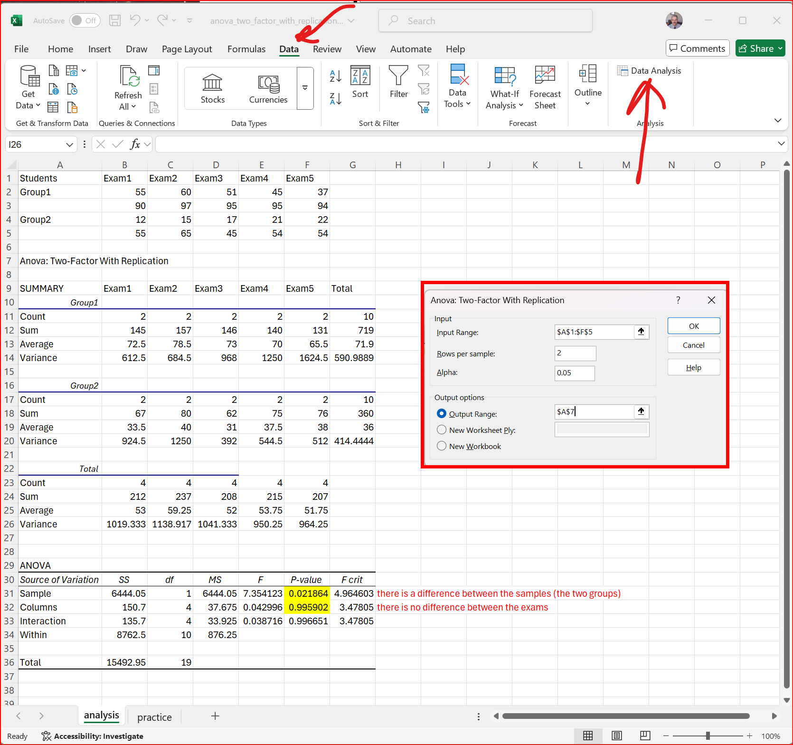

This is the extension of Anova: Single Factor. It concludes whether two data sets are related to each other or not by conducting an analysis of variance. The only difference here is that it can include more than one sample of data for each group.

[practice file: download and open](pics/anova_two_factor_with_replication.xlsx)

- Go to the ribbon and the Data tab at the top. Your Data Analysis section should be on the right if you have the toolpak installed. 
- Click the Data Analysis button. 
- Select: Anova: Two Factor with Replication.
- Enter the data in the picture.
  - you can click on the up arrow for the input range and output range to select the cells with the mouse
- If the p-value is less than 0.05 (5%), there are statistically significant differences
  - here, there is a difference between the two groups (samples)
  - but there is no difference between the exams (columns)
- you can replicate the output on the practice tab.

