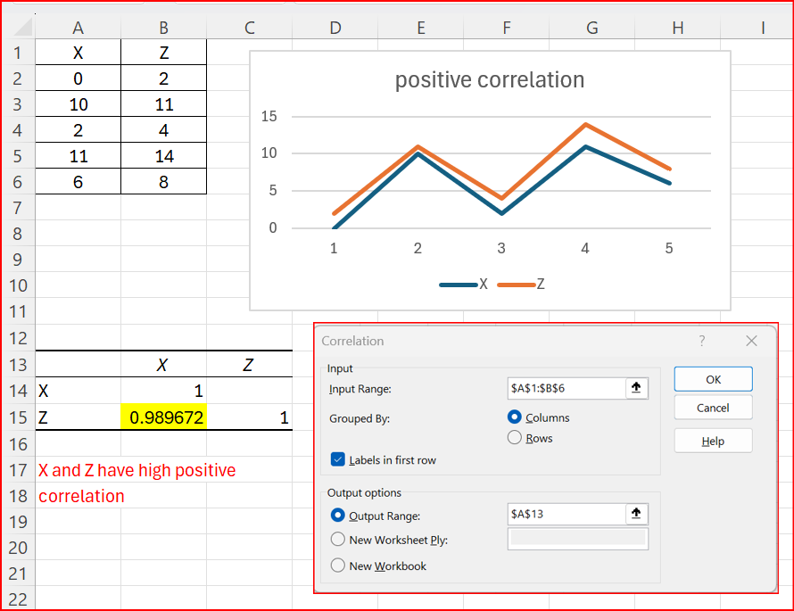
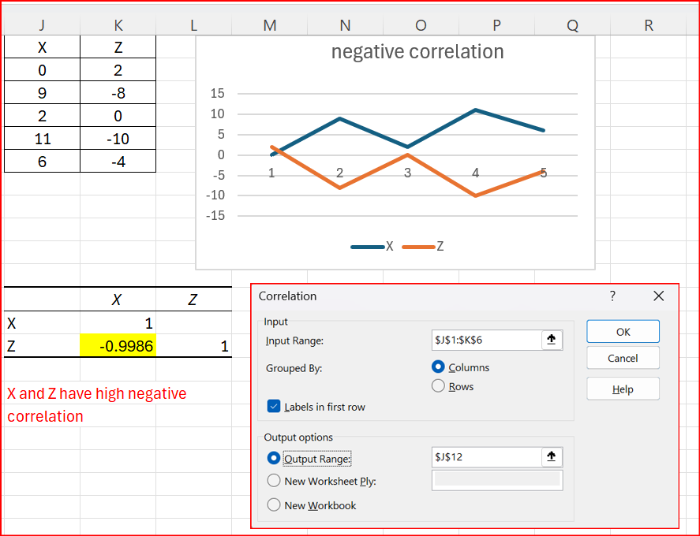
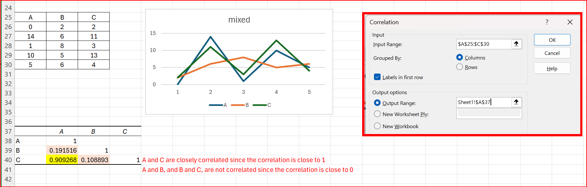

## Definition
Correlation is a measure of how strongly two variabls are related to each other. We measure it with the correlation coefficient.

- A correlation coefficient of +1 indicates a perfect positive correlation. As variable X increases, variable Y increases. As variable X decreases, variable Y decreases.
- A correlation coefficient of -1 indicates a perfect negative correlation. As variable X increases, variable Z decreases. As variable X decreases, variable Z increases.
- A correlation coefficient near 0 indicates no correlation.

[practice file: download and open](practice/correlation.xlsx)

## Procedure
- On the Data Tab, in the Analysis group, click Data Analysis.
- Select Correlation and click OK.
- Select the Input Range. You can click on the up arrow so you can select the range with the mouse.
- Check Labels in first row
- Select the Output Range
- Click OK
- Look for the numbers off the diagonal. On the diagonal, you find the correlatio of each factor with itself, and that will always be a perfect  positive correlation.

## Example of positive correlation

## Example of negative correlation

## Example of correlation between multiple factors

