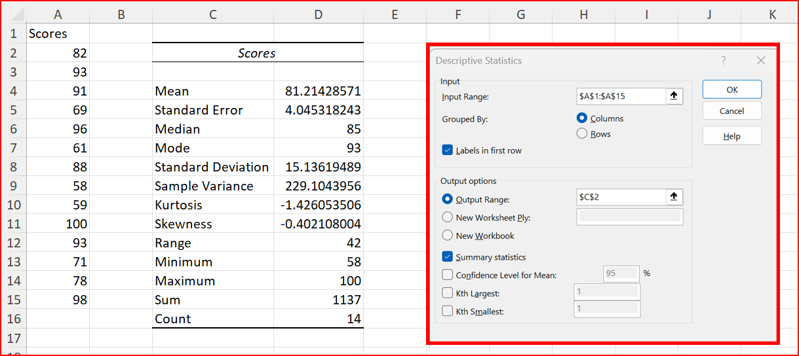

Descriptive statistics show important information about a data set. 

- The mean is the average of the values. It is sensitive to outliers (unusual values)
- The median is the number in the middle of the sorted data. It is unaffected by outliers (unusual values)
- The mode is the most frequently occurring value. It is useful for categorical data.
- The standard deviation is the average difference of each value to the mean. Higher standard deviation results from a larger spread of the data.
- The kurtosis indicates "tailedness" of the data, where one side extends much more from the mean than the other.
- The skewness indicates if the tail on the right extends more (positive) or the one on the left (negative)
- The range is how much the minimum and maximum differ.
- The minimum is the smallest value in the data.
- The maximum is the largest value in the data.
- The sum is the total of all values.
- The count is the number of data points.

[practice file: download and open](practice/descriptive_statistics.xlsx)

- Go to the ribbon and the Data tab at the top. Your Data Analysis section should be on the right if you have the toolpak installed. 
- Click the Data Analysis button. 
- Select: Descriptive Statistics
- Enter the data in the picture.
  - you can click on the up arrow for the input range and output range to select the cells with the mouse

