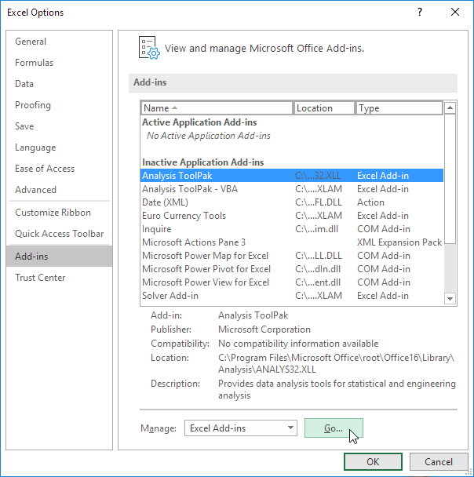
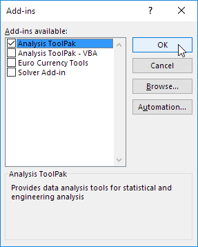
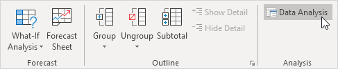
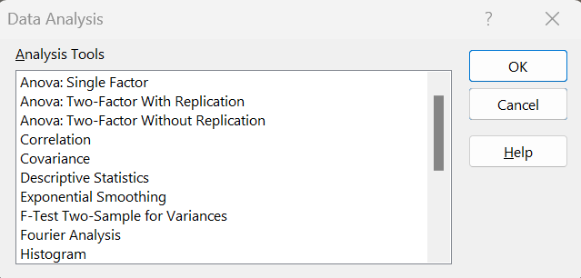
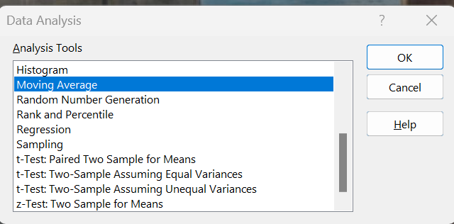

The Analysis ToolPak is an Excel add-in program that is not made available by default but can be easily installed.

To load the Analysis ToolPak add-in, execute the following steps.

1. On the File tab, click Options.

2. Under Add-ins, select Analysis ToolPak and click on the Go button.

3. Check Analysis ToolPak and click on OK.

4. On the Data tab, in the Analysis group, you can now click on Data Analysis.

5. The following dialog box below appears. Select any of the choices.

